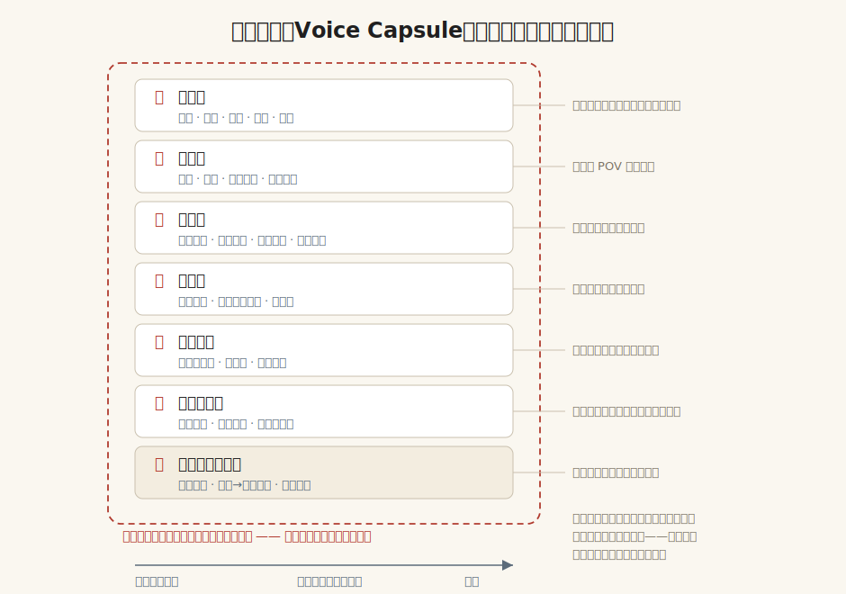
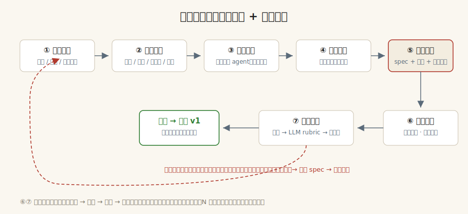

# 作家封装架构：Voice Capsule 规范

> 状态：初稿（2026-07-03）。这份文档定义「一个作家封装长什么样、怎么生产、怎么验收」。术语约定：一个封装对应一个**声部（Voice）**，声部的定义见[01-愿景与需求](01-愿景与需求.md)第三节。

## 一、总览

一个声部封装（Voice Capsule）= **规范（Spec）+ 范例库（Exemplars）+ 露馅清单（Negative）+ 判别器（Judge）+ 人格底座（Persona)+ 语料清单（Corpus）+ 调用模板（Prompts）**，可选再挂一个微调产物（LoRA）。它的形态刻意做成「一个目录就是一个技能包」——可以直接作为 Agent Skill 加载给 Claude 或任何 agent 使用，不依赖任何训练基础设施。



## 二、封装的目录结构

> 注：仓库里的 `原文/` 存**原始语料**（输入），与本节的**封装目录**（产物）是两层东西。封装目录下例仍写 `voices/<英文 id>/`；落地时一并中文化为 `声部/<中文声部名>/`（三试点已按后者：`声部/鲁迅·小说/`、`声部/红楼梦/`、`声部/柯南·道尔·福尔摩斯/`）。

```
voices/
  wang-zengqi/                  # 声部 ID（一个作家可有多个声部目录）
    SKILL.md                    # 入口：声部简介 + 何时用 + 加载清单（六种场景各自加载哪些层、每层 token 预算上限）
    spec/
      01-语言层.md              # 词汇/句法/节奏/修辞/标点，每条特征必须引原文为证
      02-叙事层.md              # 视角/时间/场景/对话
      03-结构层.md              # 篇章/情节/伏笔/节奏
      04-人物层.md              # 塑造方法/人物语言分化
      05-世界观层.md            # 母题/价值观/人性假设
      06-读者契约层.md          # 与读者的合同/期待管理
      07-底座层.md              # 知识结构/生平→母题映射/时代语境
    negative.md                 # 露馅清单：此声部绝不做什么 + 模仿者最易犯的错
    exemplars/                  # 分场景范例库（few-shot / RAG 用）
      开头.md  对话.md  写景.md  写人.md  收尾.md  ……
    corpus-lock.md              # 语料工程的锁定记录：底本/译本拍板、剔除清单、切分定义（指纹和验收都声明基于哪个版本）
    judge/
      rubric.md                 # LLM 判别器的评分规范（分层给分 + 露馅频率约束；由独立 agent 蒸馏，不读 spec）
      stylometry.json           # 计量指纹基线（句长分布/功能词频/标点谱/各负空间特征的真迹基线密度）
      testset/                  # held-out 真迹测试集——永不进 spec 和范例库（与语料隔离是硬纪律）
      negatives/                # 负样本库：同时代对照作家 + 历史仿作 + 自产仿作 hard negatives
      calibration.md            # 阈值校准：分文本长度档的置信度表、判别器自身的验收成绩
    persona.md                  # 点评场景用的第一人称人格（从底座层派生）
    corpus.md                   # 语料清单：核心/辅助分层 + 版权状态与合法获取凭证台账 + 版本学决定（底本/译本）
    prompts/                    # 六种调用场景的现成模板：生成/改写/点评/判别/杂交/学习
    evolution.md                # （可选）早中晚期差异，默认锁巅峰期
    lora/                       # （可选，V2）微调产物与训练配置
```

设计意图有三条：

1. **人可读优先，且基座无关（硬约束）。** 每一层 spec 都是给人看的文学分析文档，只是写法受纪律约束（见下）。这保证封装同时是「AI 的调用包」和「人的写作教程」，也保证可以被专家审阅、被版本化演进。更重要的是：spec、范例、露馅清单、判别 rubric、测试集这些本体资产不绑定任何基座模型——NovelAI 的作家模块因为绑死基座、2024 年换代后全部报废（见调研文档），这个教训定为硬约束：**任何模型权重（LoRA）只能是可再生的缓存，不是资产本体。**
2. **证据纪律。** spec 里的每一条特征断言，必须附带至少两处原文引文作为证据，并注明出处。没有引文的断言视为猜测，不许进 spec。这条纪律直接决定蒸馏质量——它逼着蒸馏过程贴着文本走，而不是复述文学史常识（「鲁迅冷峻」这种话没有任何操作价值）。
3. **负空间独立成文件，但用频率约束不用布尔禁令。** 露馅清单不是 spec 的附录，而是和 spec 平级的一等公民。对抗审查抓到了初稿的机制级错误：「禁感叹号」式的一票否决会把真迹本身判死（《受戒》的情感高点「要！」带感叹号；海明威《Indian Camp》结尾就是直接的内心陈述）——作家自己也会在正确的地方违反自己的惯例，那正是 L3。修正后的规则：**条目写成频率/密度约束**（如「感叹号密度不超过真迹基线的高位分位」，阈值直接取自 stylometry.json），只有真迹中严格零出现的模式才保留硬否决；清单上岗前必须在真迹全集上回放自校验，任何误杀真迹的条目回炉。
4. **条目可寻址。** spec 与露馅清单的每个条目带稳定 ID 和最小结构化头（层/规则/证据/严重度），Markdown 正文保持人可读，机器按 ID 抽取规则——这是「杂交实验按层拆装」和「差距归因落到具体条目」的前提。
5. **spec 内容分两个发布面。** 引文全文与原文范例标 internal（**任一相关法域**仍在版权期的声部——封装含大量原文摘录，本身是版权敏感物；注意 URAA：老舍等在大陆已公版、但在美国经 URAA 恢复版权至 2030s+，仓库托管在美国故按「版权期声部」处理，原文引文不入公开仓）；对外发布物只含决策规则+特征描述+指向性出处。生成时默认注入「决策规则压缩版」（剥离引文），既省 token 又降低原文回吐概率。

## 三、Spec 各层的内容纪律

每层文档统一用三段式写：**特征（是什么）→ 证据（原文引文）→ 决策规则（把特征改写成生成时可执行的指令）**。以语言层为例，一条合格的条目长这样：

> **特征**：汪曾祺极少使用超过一个的前置形容词，情绪从不直接陈述，而是落在动作和物件上。
> **证据**：《受戒》写明海动心，只写「小英子把吃剩的半个莲蓬扔给他」；《大淖记事》写巧云被辱后，只写「她把一坛子酒喝掉了一半」。
> **决策规则**：生成时禁止「悲伤地」「愤怒地」一类状语；人物情绪必须转译为一个具体动作或一件具体物品；连用两个形容词时删掉一个。

各层要回答的核心问题清单（蒸馏 agent 的作业提纲）：

| 层 | 必须回答的问题（节选） |
|---|---|
| 语言层 | 高频与禁忌词表？句长分布和长短句交替规律？文白/雅俗配比？比喻从哪些领域取材？标点有什么脾气（感叹号频率、破折号用法）？ |
| 叙事层 | 默认视角和越界规则？时间怎么折叠？一场戏从哪里切入、在哪里切走？对话承担什么功能、人物说话时叙述者在干什么？ |
| 结构层 | 开头的惯用手法？章节切分逻辑？伏笔的埋设密度和回收距离？高潮前后的节奏配比？ |
| 人物层 | 出场怎么立人？靠什么区分人物语言？人物弧的典型形状？ |
| 世界观层 | 反复出现的三五个母题是什么？道德立场放在文本的什么位置（说出来/藏起来）？对人性的默认假设？ |
| 读者契约层 | 承诺给读者什么回报？多久兑现一次？什么东西故意不给？ |
| 底座层 | 知识库的构成？哪些生平事件直接映射为母题？他自己怎么谈写作（创作谈）？ |

体裁会改变各层权重：诗词声部（李白、狄金森）语言层几乎是全部，结构层退化为格律与章法；长篇小说声部结构层权重最高；散文声部叙事层和读者契约层合并。封装模板按体裁分四套底版（诗/散文/中短篇/长篇），字段同构、权重不同。

## 四、蒸馏流水线：怎么生产一个封装



七步，前四步是分析，后三步是闭环：

1. **语料分层。** 核心语料（代表作全文）、辅助语料（次要作品、书信、创作谈、访谈）、外部语料（权威评论与研究）。三层用途不同：核心语料喂指纹和 spec，辅助语料只喂底座层，外部语料用来校准蒸馏 agent 的判断、防止闭门造车。这一步必须先做三个决定并写进 corpus.md：**版本学拍板**（《红楼梦》锁脂本还是程本、《水浒》用哪个系统——否则判别器学到的是版本差异不是风格指纹）、**译本绑定**（外国作家的中文声部绑哪个译本）、**语料甄别**（剔除代笔、笔录、他人译笔——古龙后期代笔、木心《文学回忆录》系陈丹青笔录、林语堂多为英文写作他人汉译）。
2. **计量指纹。** 用文体计量工具跑出客观基线：句长分布、词频谱、功能词特征、标点谱、词汇丰富度。这一步的产出直接存进 `judge/stylometry.json`，同时给深读 agent 提供「不会说谎的地面真值」——人和 LLM 的印象派判断需要被数字校正。
3. **多维深读。** 每层一个深读 agent，按上表的问题清单精读核心语料，按「特征→证据→决策规则」三段式产出 spec 草稿。负空间单独一个 agent，任务就是回答「这位作家和同代人相比，少了什么」。三条工程纪律：**结构索引先行**——结构层和读者契约层的特征（伏笔回收距离、期待节奏）是跨块的长程特征，分块精读在机制上读不到，先建全书结构索引（章回摘要+事件线+伏笔图谱），这两层的 agent 读索引+抽样原文；**引文程序化验真**——spec 草稿里每条引文用程序在语料库里精确/模糊匹配，带篇章定位符，匹配不过阈值的断言自动打回「猜测」区（这是纯字符串工程，零成本防幻觉引文），转述类证据显式标注「情节证据（非字面引文）」并降权；**结构型声部走双轨语料**——语言层指纹可抽样，结构层特征必须全文过一遍结构标注管线，封装进账本（伏笔图谱、章末钩子清单、节拍序列）而不是原文，否则「按卷抽样」会把网文声部的核心卖点变成空头支票。
4. **评论吸收。** 把权威研究（夏志清、王德威、哈罗德·布鲁姆、作家专论）的洞见合并进 spec，标注来源。文学批评界积累了一百年的风格分析，不用是傻的；但规则是评论只能提供线索，最终仍须回到原文找引文证据。
5. **编纂封装。** 合并各层草稿，冲突按证据强度裁决（引文数量与校验状态即裁决依据），裁不动的显式保留为「张力条目」而非静默删除，裁剪记录进版本历史；写 SKILL.md 和调用模板，范例库按场景选段。
6. **试写与判别。** 用封装生成一批文本（覆盖六种调用场景），混入真迹，过三层判别（见下节）。验收测试集强制三组对照：真迹、同题材他人写作（时代对照组）、生成物的题材控制版（用真迹题材命题）——判别报告必须拆出「题材可解释方差」，题材信号占主导即验收无效（防「鲁迅=写旧中国」式内容泄漏）。
7. **差距归因与迭代。** 判别不过的地方，归因到具体层的具体条目 ID——是语言层的节奏没抓住，还是负空间漏了一条约束——修订后回到第 5 步。**闭环纪律（防 Goodhart 漂移）**：held-out 测试集冻结、每轮迭代强制回归，任何已通过项退化即回滚；spec 修订走版本 diff+新旧判别 A/B，禁止无对照的「改完感觉更好」；停机条件以人类盲测为准，连续 N 轮无提升即停并升级人工介入；人类抽检从「发布前」改为每 K 轮固定抽检。通过后发布 v1，此后每次真实使用中发现的露馅点持续回流。

这个流水线本身就是一个多 agent 工作流，而且第 6-7 步和评测方法论完全同构（生成→判别→归因→迭代的自举循环）——判别器就是这个项目的「评测」，蒸馏质量是被评测逼出来的。

## 五、判别器：整个系统的地基

**判别器判什么、不判什么（避免误读）**：它回答的是「一段**新生成或未见过的**文本，像不像该作家」——这段文本在世界上不存在，搜索引擎/RAG 查不到出处，只能靠对文体的度量来判。它**不是**「这段真迹是谁写的」的溯源工具（那是闭卷查找，大模型+检索直接可得，与本项目无关）。判别器的意义完全绑定在写作场景上：①**评测尺子**——量生成物离真作有多远（验收）；②**拒绝采样筛子**——从 N 个候选里挑最像的。没有这把尺子，「像不像」就退化回无法评测的「写得好不好」。主指标之所以用**独立于 LLM 生成器的计量判别器**、而非直接问 LLM，是为了防止生成器给自己打分的结构性共谋（见下元规则一）。

先立三条元规则（对抗审查后确立）：**其一，rubric 与 spec 强制解耦**——判别 rubric 由不读 spec 的独立 agent（最好不同基座）蒸馏，否则生成器按 spec 写、判别器按 spec 的镜像打分，是按自己的 checklist 自查，结构性自我共谋。**其二，判别器先于生成上岗验收**——在 held-out 真迹、同代作家、已知劣仿三类样本上先测出精度（这份成绩存进 judge/calibration.md），达标才准进迭代循环；试点声部的第一个交付物就是「中文判别精度基线报告」。**其三，L2（方法论复用）的验收单独定义**——跨语言/跨题材调用结构层技法时计量指纹天然失效，验收改测「决策规则命中率」（生成文本是否在每个决策点执行了 spec 条目，逐条核查如单元测试）+人工评审，不冒充「像不像」盲测。

每个声部的判别器分三层，成本递增、权威度递增：

1. **计量层（毫秒级、免费）**：拿生成文本的计量指纹和 `stylometry.json` 基线比对。句长分布跑偏、功能词谱不对，直接打回，根本不用请示 LLM。它还有一个关键作用：**防止 LLM 判别器被表面词汇欺骗**——堆满「月亮」「苍凉」的文本骗得过印象分，骗不过功能词谱。
1.5 **风格嵌入层（短文本的降级路由）**：计量层可靠判别需数千字，而改写/点评等真实调用粒度只有几百到一两千字——落在计量层的失效区间。用对比学习的作者风格嵌入（同作者拉近、异作者推远）做向量相似度，短文本自动降级路由到这一层；判别器输出强制带长度分档置信度。
2. **LLM 判别层（秒级、但不便宜）**：按 `judge/rubric.md` 分层打分（语言/叙事/结构各自给分），露馅清单按频率约束逐条核查（见第二节第 3 条，不再是布尔否决）。要求输出证据（指认哪一句露馅、命中哪条 ID），不许只给分数。注意成本：全量 rubric 判别的 token 开销与一次生成同量级，交互场景（改写/点评）限 N≤3 候选、只走嵌入层前置+单次 LLM 判别；离线场景才开全量拒绝采样。各层拦截率与单位成本在试点上实测后回填，「筛掉 90%」目前是未经验证的估计。
3. **人类盲测层（天级、贵）**：真迹与生成文本混排，请熟读该作家的读者辨认。只在版本发布前和重大迭代后跑。**验收分两档**：普通读者盲测和专家认可是两道门槛——微软小冰用 27 个匿名马甲骗过了读者和编辑，仍被诗人集体差评「平庸」（见调研文档）。声部发布标准写死在专家档。

判别器的第二个用途是**拒绝采样**：生成 N 个候选，判别器筛掉大部分，剩下的才见人。这是把输出从「均值附近」推向「分布尾部」的机制性手段——但推向的是「相似度分布」的尾部（最像该作家），**不是 L3**。对抗审查指出了初稿的机制矛盾：L3 的定义是「对自身惯例的恰当背叛」，恰恰会在指纹上偏离基线，一个严格按基线筛选的判别器在结构上会杀掉 L3 候选（真迹《小团圆》混进张爱玲巅峰期候选池大概率被计量层打回）。因此 L3 维持「不承诺」；设想中的 L3 通道（豁免语言层计量、只过中高层判别、人类专家终审）标注为未验证的开放问题。

**一个必须直面的风险**：判别器存在循环性——如果 LLM 判别器和生成器共享同一套对「该作家像什么」的浅层印象，就会出现自己骗自己的共谋。对抗审查确认这个风险比初稿写的更重（spec 与 rubric 若同源，是字面上的同一份文档在自查），处置即上文元规则一、二；计量层的非 LLM 独立证据和人类盲测锚点作为兜底。

调研（见 04 文档第三节）补齐了另外四道防线，定为判别器的标准配置：

- **防 reward hacking**：判别器一旦被当奖励优化，生成器会学出「骗过判别器但不像巨匠」的捷径。用 held-out 判别器、多判别器投票、对偏离基线的幅度加 proximity 正则。
- **防内容泄漏**：判别器最大陷阱是把题材当风格（「鲁迅=写旧中国」）。评测集必须含同题材改写平行样本，逼判别信号来自文体而非内容。
- **对抗加固**：我们主动模仿巨匠，天然处在对抗设定里（刻意模仿可把归属器打到接近随机）——自产仿作要当 hard negative 持续回灌判别器。
- **回吐检测**：判别器兼任「与原文实质相似」的拦截器，这既是质量问题（抄不是仿）也是法律高风险点（见 04 文档第七节）。

## 六、技术路线：为什么 V0 不训练

三条路线的取舍：

| 路线 | 优点 | 缺点 | 我们的用法 |
|---|---|---|---|
| Spec + 范例（prompt 工程） | 零训练成本；可解释、可审阅、可细粒度修订；跨模型可迁移；人可以直接读 | 上下文长度吃紧；语言层的「肌理」传递有损 | **V0 主体** |
| RAG 检索范例 | 范例库可以做大；按场景动态取例 | 检索质量决定上限；只适合知识底座层，带不来文风内化 | V0 辅助（exemplars 按场景检索） |
| LoRA/SFT 微调 | 语言层肌理保真度最高（尤其节奏和句法这种难以言传的东西）；已有成熟范式（LoRA 学风格+与指令模型合并，归属分类器 F1 可达 0.90+） | 有成本；不可解释；改一条规则要重训；换基座模型作废；版权风险最大 | V1 候选主路线（限公版声部），是否启用以试点的 spec vs naive prompt 对照数据为准 |

关键判断：**spec 路线的天花板取决于「风格可言传的比例」**。叙事、结构、人物、世界观层几乎完全可言传（它们本来就是文学批评的传统领域）；语言层大约七成可言传（词表、禁忌、修辞取材都可以写成规则），剩下三成——节奏、腔调这种肌肉记忆——要靠范例和微调补。

调研之后这里要做一次诚实的校准（证据见 04 文档：few-shot 从 2 例加到 10 例几乎无增益、精心设计的免训练模板对长文只有边际提升）：**V0 的目标不再是「普通读者盲测过关」，而是把判别器闭环跑通、拿到每个试点声部的 prompt 路线天花板数据**——一段好的 style prompt 是我们的 baseline，封装打不过它就没有存在价值；language 层肌理的真正保真大概率要靠 V1 的 LoRA（限公版声部）。范例库的 in-context 规模从 2k-10k 字区间起步做对比（中文仿鲁迅社区实验的经验值：0k 套路、2k 明显改善、10k 以上边际递减）。

先跑通三个试点声部再谈规模化。试点选择的原则修正为「最快闭环」而非「测模板极限」（对抗审查指出：史记会同时撞上文言计量工具未验证、同代对照组难建、验收目标含混、盲测读者难找四个最难的问题——试点的任务是验证方法论，不是压力测试）。修正后的试点：**鲁迅·小说声部**（指纹极强、公版、现代白话）、**《红楼梦》声部**（作品声部代表、人物语言分化天花板；接受底本拍板的版本学负担）、**老舍·小说声部**（公版、指纹 5、京白口语声口与鲁迅的文白欧化拉开距离、盲测读者好找）。《史记》降级为方法论稳定后的压力测试项，先单独做「文言计量特征可行性」的小实验。

**生产分级与消融**：七层保留为分析框架，但产物分两档——core（语言层+负空间+范例库+判别器，所有声部必做）与 extended（其余层按名录「主攻层」字段选配）。试点必须做消融实验：同一声部跑「naive style prompt（Sudowrite 式 2000 字样本+风格描述）/ core capsule / full capsule」三档，过同一判别器——用项目自己信奉的评测驱动方法论，评测七层模型本身值不值七层的成本。

## 七、露馅清单示例（负空间长什么样）

以汪曾祺声部为例，节选几条感受一下这个文件的颗粒度：

- 禁：连续堆叠两个以上形容词（「宁静而美好的黄昏」直接判死）；
- 禁：直接陈述人物情绪（悲伤、高兴、愤怒等词不许落在人物身上，改写成动作或物件）；
- 禁：感叹号（全集感叹号密度极低，出现即露馅）；
- 禁：欧化长句与「被」字滥用；
- 禁：形而上议论收尾（汪曾祺收尾永远落在具体的东西上——一碗咸菜茨菇汤，不是一句人生感悟）；
- 高危：把「淡」做成寡淡。汪的平淡之下有极精确的细节选择，模仿者常学到「不写什么」却没学到「留下的那一笔为什么是这一笔」。

注意：以上「禁」是初稿的示意写法，机制化时全部按第二节第 3 条转为频率约束——《受戒》的情感高点「要！」就带感叹号，布尔禁令会误杀真迹；正式条目格式为「特征 X 的真迹基线密度 N/千字，超出 M 倍扣分/否决」，阈值取自 stylometry.json。

## 八、版本与演进

- 每个封装带版本号，v1 = 首次通过三层盲测。此后 spec 的每次修订记录动机（哪次露馅触发的）。**验收结论必须绑定版本三元组（corpus-lock × rubric 版本 × 判别模型 ID）**——LLM 判别层绑定具体基座，判别模型升级会导致打分分布漂移，历史「已通过」不再可信；升级时用 testset 里的锚点样本（已知真迹+已知仿作）重跑校准，漂移超阈值则该封装降级为「待复验」。计量层是纯统计、真正基座无关，是验收结论的长期锚点。
- 公共层（「明清白话」「五四白话」「网文节奏」这类跨声部共享底料）**V0 明确不做**：每声部自包含，重复就重复。公共层涉及依赖管理、下游回归验收、「时代共性 vs 个人指纹」的准入验证，是 424 声部规模才需要的机制，现在设计是过度工程。
- 名录扩张遵循「指纹强度优先」：指纹越强的作家越先做，因为验收越容易、闭环越快。风格透明的巨匠（托尔斯泰这类以「无风格」著称的）排后面，他们的价值在中高层，验收标准要单独设计。
